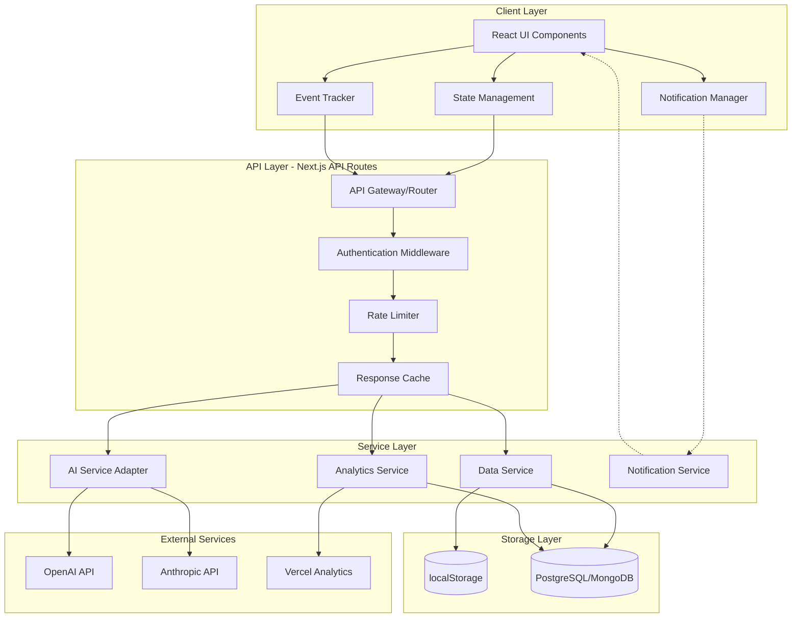
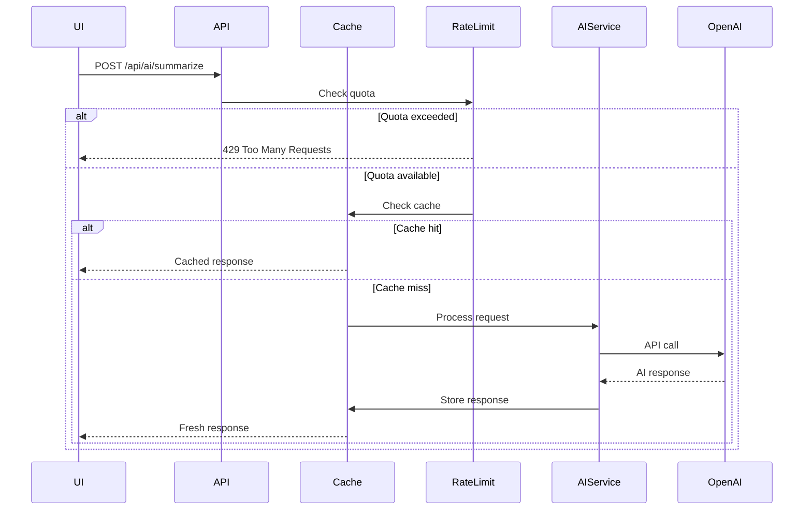
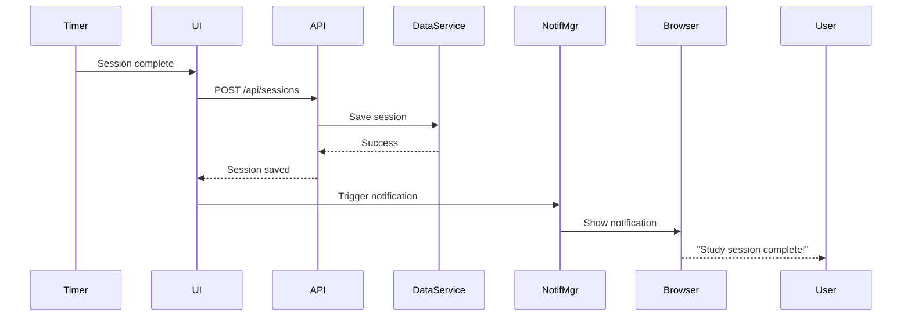
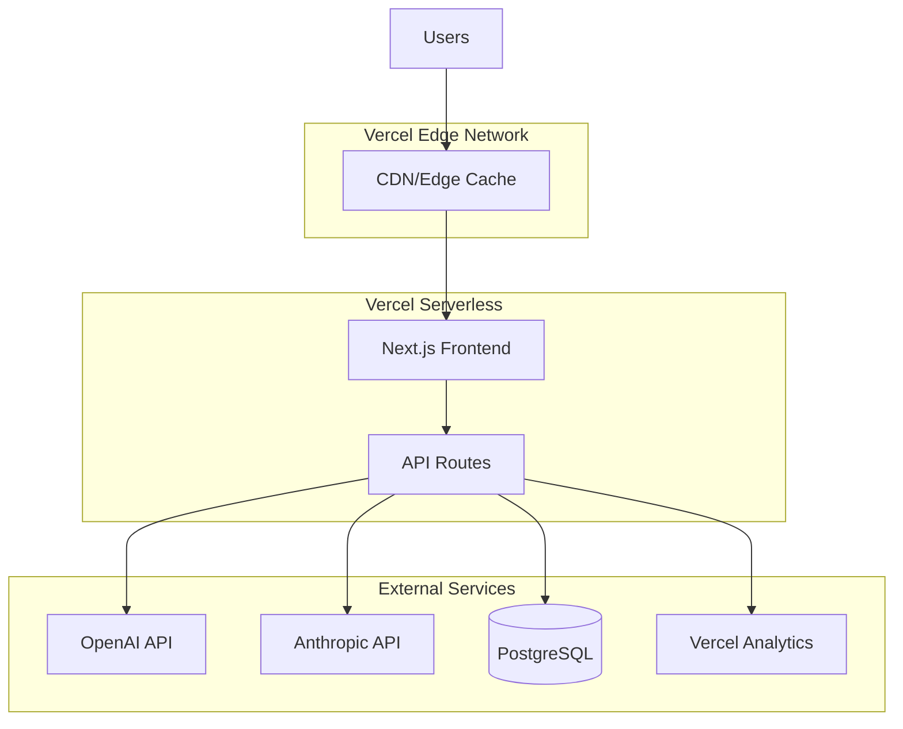

# Design Document: Backend AI Notifications Analytics

## Overview

This design document specifies the architecture and implementation details for completing the Smart AI Study Assistant by adding four critical components: Backend API, Real AI Integration, Notification System, and Analytics. The system will transform the existing frontend prototype (92% complete) into a production-ready application with persistent data storage, real AI-powered features, intelligent notifications, and comprehensive usage tracking.

### System Context

The application is a Next.js-based study assistant that currently uses mock data and localStorage. This design adds:

1. **Backend API Layer**: Next.js API routes providing RESTful endpoints for data persistence and AI service coordination
2. **AI Integration**: OpenAI/Anthropic Claude integration for text summarization and quiz generation
3. **Notification System**: Browser-based notifications for study events and reminders
4. **Analytics Platform**: Event tracking, usage analytics, and Vercel Analytics integration

### Design Goals

- **Minimal Frontend Changes**: Leverage existing UI components and data structures
- **Flexible Storage**: Support both localStorage (simple) and database (scalable) backends
- **Cost Optimization**: Implement caching and rate limiting to control AI API costs
- **Privacy-First**: User control over data collection and analytics
- **Production-Ready**: Comprehensive error handling, monitoring, and deployment support

### Technology Stack

- **Frontend**: Next.js 16.2.4, React 19, TypeScript, Tailwind CSS
- **Backend**: Next.js API Routes (serverless functions)
- **AI Services**: OpenAI GPT-4 or Anthropic Claude-3-Sonnet
- **Storage Options**: 
  - localStorage (client-side, existing)
  - PostgreSQL/MongoDB (server-side, optional)
- **Analytics**: Vercel Analytics, custom event tracking
- **Deployment**: Vercel platform
- **Notifications**: Browser Notification API


## Architecture

### System Architecture Diagram



### Component Responsibilities

#### Client Layer

**React UI Components**
- Existing components: notes, quiz, summarizer, study tracker, settings
- Minimal modifications to integrate with backend APIs
- Display loading states, errors, and success messages

**State Management (store.ts)**
- Current: localStorage-based state management
- Enhanced: API integration for persistence
- Maintains backward compatibility with existing interface

**Notification Manager**
- Request and manage browser notification permissions
- Display notifications for study events
- Handle notification clicks and actions
- Respect user preferences

**Event Tracker**
- Capture user interactions (note saves, quiz completions, study sessions)
- Batch events for efficient transmission
- Respect privacy preferences

#### API Layer

**API Gateway/Router**
- Route requests to appropriate service handlers
- Implement CORS policies
- Request validation and sanitization
- Structured error responses

**Authentication Middleware**
- JWT token validation (when database storage is used)
- Session management
- Optional for localStorage mode

**Rate Limiter**
- Per-user/IP request throttling
- Token budget enforcement
- 429 responses with retry-after headers

**Response Cache**
- Hash-based cache keys for AI responses
- 24-hour TTL
- LRU eviction (1000 entry limit)
- Cache hit/miss tracking

#### Service Layer

**AI Service Adapter**
- Unified interface for OpenAI and Anthropic
- Prompt template management
- Token counting and budget enforcement
- Retry logic with exponential backoff
- Response validation and parsing

**Data Service**
- Abstract storage interface
- localStorage proxy endpoints (for client-side storage)
- Database operations (for server-side storage)
- Data migration support

**Analytics Service**
- Event collection and aggregation
- Study session analytics calculation
- Privacy-compliant data handling
- Vercel Analytics integration

**Notification Service**
- Server-side notification scheduling (future)
- Notification preference management
- Currently: client-side only

### Data Flow Patterns

#### AI Request Flow



#### Study Session Flow



### API Endpoint Structure

All endpoints follow RESTful conventions and return JSON responses.

**Base URL**: `/api/v1`

**Endpoint Categories**:
- `/api/v1/ai/*` - AI service endpoints
- `/api/v1/sessions/*` - Study session management
- `/api/v1/notes/*` - Note persistence
- `/api/v1/analytics/*` - Analytics and reporting
- `/api/v1/preferences/*` - User preferences
- `/api/v1/auth/*` - Authentication (optional)
- `/api/v1/health` - Health check


## Components and Interfaces

### API Endpoints Specification

#### AI Endpoints

**POST /api/v1/ai/summarize**

Generate a summary and key points from input text.

Request:
```typescript
{
  text: string;        // 1-4000 tokens
  options?: {
    maxKeyPoints?: number;  // 3-7, default: 5
    temperature?: number;   // 0-1, default: 0.3
  }
}
```

Response:
```typescript
{
  success: boolean;
  data: {
    summary: string;
    keyPoints: string[];
    metadata: {
      inputTokens: number;
      outputTokens: number;
      model: string;
      cached: boolean;
      processingTime: number;
    }
  }
}
```

Error Response:
```typescript
{
  success: false;
  error: {
    code: string;  // "RATE_LIMIT_EXCEEDED" | "INVALID_INPUT" | "AI_SERVICE_ERROR" | "TIMEOUT"
    message: string;
    retryAfter?: number;  // seconds
    details?: any;
  }
}
```

**POST /api/v1/ai/generate-quiz**

Generate quiz questions from input text.

Request:
```typescript
{
  text: string;        // 100-4000 tokens
  options?: {
    questionCount?: number;  // 3-5, default: 4
    difficulty?: "easy" | "medium" | "hard";  // default: "medium"
    temperature?: number;   // 0-1, default: 0.5
  }
}
```

Response:
```typescript
{
  success: boolean;
  data: {
    questions: Array<{
      id: string;
      question: string;
      options: [string, string, string, string];  // exactly 4
      correctAnswer: number;  // 0-3
      explanation: string;
    }>;
    metadata: {
      inputTokens: number;
      outputTokens: number;
      model: string;
      cached: boolean;
      processingTime: number;
    }
  }
}
```

#### Session Endpoints

**POST /api/v1/sessions**

Create a new study session.

Request:
```typescript
{
  duration: number;     // seconds
  notes: string;
  startTime: string;    // ISO 8601
  endTime: string;      // ISO 8601
}
```

Response:
```typescript
{
  success: boolean;
  data: {
    id: string;
    duration: number;
    notes: string;
    startTime: string;
    endTime: string;
    createdAt: string;
  }
}
```

**GET /api/v1/sessions**

Retrieve study sessions.

Query Parameters:
- `limit`: number (default: 50, max: 100)
- `offset`: number (default: 0)
- `startDate`: ISO 8601 date
- `endDate`: ISO 8601 date

Response:
```typescript
{
  success: boolean;
  data: {
    sessions: Array<{
      id: string;
      duration: number;
      notes: string;
      startTime: string;
      endTime: string;
      createdAt: string;
    }>;
    pagination: {
      total: number;
      limit: number;
      offset: number;
      hasMore: boolean;
    }
  }
}
```

**DELETE /api/v1/sessions/:id**

Delete a study session.

Response:
```typescript
{
  success: boolean;
  data: {
    deleted: boolean;
    id: string;
  }
}
```

#### Notes Endpoints

**POST /api/v1/notes**

Save or update notes.

Request:
```typescript
{
  content: string;
  lastModified: string;  // ISO 8601
}
```

Response:
```typescript
{
  success: boolean;
  data: {
    content: string;
    lastModified: string;
    savedAt: string;
  }
}
```

**GET /api/v1/notes**

Retrieve current notes.

Response:
```typescript
{
  success: boolean;
  data: {
    content: string;
    lastModified: string;
  }
}
```

#### Analytics Endpoints

**POST /api/v1/analytics/events**

Submit analytics events (batched).

Request:
```typescript
{
  events: Array<{
    type: "note_saved" | "summary_generated" | "quiz_generated" | 
          "quiz_completed" | "session_started" | "session_completed";
    timestamp: string;  // ISO 8601
    sessionId: string;
    metadata?: Record<string, any>;
  }>;
}
```

Response:
```typescript
{
  success: boolean;
  data: {
    received: number;
    processed: number;
  }
}
```

**GET /api/v1/analytics/summary**

Get aggregated analytics.

Query Parameters:
- `startDate`: ISO 8601 date (default: 30 days ago)
- `endDate`: ISO 8601 date (default: now)

Response:
```typescript
{
  success: boolean;
  data: {
    totalStudyTime: number;      // seconds
    sessionCount: number;
    averageSessionDuration: number;  // seconds
    studyStreak: number;         // consecutive days
    mostProductiveHour: number;  // 0-23
    mostProductiveDay: string;   // "Monday" etc.
    featureUsage: {
      summariesGenerated: number;
      quizzesGenerated: number;
      quizzesCompleted: number;
      notesSaved: number;
    };
    dailyBreakdown: Array<{
      date: string;
      studyTime: number;
      sessionCount: number;
    }>;
  }
}
```

**DELETE /api/v1/analytics/data**

Delete user analytics data (privacy compliance).

Response:
```typescript
{
  success: boolean;
  data: {
    deleted: boolean;
    recordsRemoved: number;
  }
}
```

#### Preferences Endpoints

**GET /api/v1/preferences**

Get user preferences.

Response:
```typescript
{
  success: boolean;
  data: {
    notifications: {
      enabled: boolean;
      studyReminders: boolean;
      sessionComplete: boolean;
      dailySummary: boolean;
      breakInterval: number;  // minutes
    };
    analytics: {
      enabled: boolean;
      consentGiven: boolean;
      consentDate: string;
    };
    theme: "light" | "dark" | "system";
  }
}
```

**PUT /api/v1/preferences**

Update user preferences.

Request:
```typescript
{
  notifications?: {
    enabled?: boolean;
    studyReminders?: boolean;
    sessionComplete?: boolean;
    dailySummary?: boolean;
    breakInterval?: number;
  };
  analytics?: {
    enabled?: boolean;
  };
  theme?: "light" | "dark" | "system";
}
```

Response: Same as GET /api/v1/preferences

#### Authentication Endpoints (Optional - Database Mode Only)

**POST /api/v1/auth/register**

Request:
```typescript
{
  email: string;
  password: string;  // min 8 chars
  name?: string;
}
```

Response:
```typescript
{
  success: boolean;
  data: {
    user: {
      id: string;
      email: string;
      name: string;
    };
    token: string;  // JWT
    expiresAt: string;
  }
}
```

**POST /api/v1/auth/login**

Request:
```typescript
{
  email: string;
  password: string;
}
```

Response: Same as register

**POST /api/v1/auth/refresh**

Request:
```typescript
{
  token: string;  // current JWT
}
```

Response:
```typescript
{
  success: boolean;
  data: {
    token: string;  // new JWT
    expiresAt: string;
  }
}
```

**POST /api/v1/auth/reset-password**

Request:
```typescript
{
  email: string;
}
```

Response:
```typescript
{
  success: boolean;
  data: {
    message: string;
    resetLinkSent: boolean;
  }
}
```

#### Health Check Endpoint

**GET /api/v1/health**

Response:
```typescript
{
  status: "healthy" | "degraded" | "unhealthy";
  timestamp: string;
  services: {
    api: "up" | "down";
    database: "up" | "down" | "not_configured";
    aiService: "up" | "down";
    cache: "up" | "down";
  };
  version: string;
}
```

### TypeScript Interfaces

#### Core Data Models

```typescript
// AI Service Types
export interface AIProvider {
  name: "openai" | "anthropic";
  summarize(text: string, options?: SummarizeOptions): Promise<SummaryResult>;
  generateQuiz(text: string, options?: QuizOptions): Promise<QuizResult>;
  countTokens(text: string): number;
}

export interface SummarizeOptions {
  maxKeyPoints?: number;
  temperature?: number;
}

export interface SummaryResult {
  summary: string;
  keyPoints: string[];
  metadata: AIMetadata;
}

export interface QuizOptions {
  questionCount?: number;
  difficulty?: "easy" | "medium" | "hard";
  temperature?: number;
}

export interface QuizResult {
  questions: QuizQuestion[];
  metadata: AIMetadata;
}

export interface QuizQuestion {
  id: string;
  question: string;
  options: [string, string, string, string];
  correctAnswer: number;
  explanation: string;
}

export interface AIMetadata {
  inputTokens: number;
  outputTokens: number;
  model: string;
  cached: boolean;
  processingTime: number;
}

// Study Session Types
export interface StudySession {
  id: string;
  duration: number;
  notes: string;
  startTime: string;
  endTime: string;
  createdAt: string;
  userId?: string;  // optional, for database mode
}

// Notes Types
export interface Notes {
  content: string;
  lastModified: string;
  userId?: string;  // optional, for database mode
}

// Analytics Types
export interface AnalyticsEvent {
  type: EventType;
  timestamp: string;
  sessionId: string;
  metadata?: Record<string, any>;
  userId?: string;  // optional, for database mode
}

export type EventType =
  | "note_saved"
  | "summary_generated"
  | "quiz_generated"
  | "quiz_completed"
  | "session_started"
  | "session_completed";

export interface AnalyticsSummary {
  totalStudyTime: number;
  sessionCount: number;
  averageSessionDuration: number;
  studyStreak: number;
  mostProductiveHour: number;
  mostProductiveDay: string;
  featureUsage: FeatureUsage;
  dailyBreakdown: DailyBreakdown[];
}

export interface FeatureUsage {
  summariesGenerated: number;
  quizzesGenerated: number;
  quizzesCompleted: number;
  notesSaved: number;
}

export interface DailyBreakdown {
  date: string;
  studyTime: number;
  sessionCount: number;
}

// User Preferences Types
export interface UserPreferences {
  notifications: NotificationPreferences;
  analytics: AnalyticsPreferences;
  theme: "light" | "dark" | "system";
  userId?: string;  // optional, for database mode
}

export interface NotificationPreferences {
  enabled: boolean;
  studyReminders: boolean;
  sessionComplete: boolean;
  dailySummary: boolean;
  breakInterval: number;
}

export interface AnalyticsPreferences {
  enabled: boolean;
  consentGiven: boolean;
  consentDate: string;
}

// Authentication Types (Database Mode)
export interface User {
  id: string;
  email: string;
  name: string;
  passwordHash: string;
  createdAt: string;
  lastLogin: string;
}

export interface AuthToken {
  token: string;
  expiresAt: string;
  userId: string;
}

// Configuration Types
export interface AppConfig {
  storage: {
    mode: "localStorage" | "database";
    databaseUrl?: string;
  };
  ai: {
    provider: "openai" | "anthropic";
    apiKey: string;
    model: string;
    maxInputTokens: number;
    maxOutputTokens: {
      summary: number;
      quiz: number;
    };
  };
  rateLimit: {
    requestsPerHour: number;
    enabled: boolean;
  };
  cache: {
    enabled: boolean;
    ttl: number;
    maxEntries: number;
  };
  auth: {
    required: boolean;
    jwtSecret?: string;
    tokenExpiry: number;
  };
  analytics: {
    vercelEnabled: boolean;
  };
}

// API Response Types
export interface APIResponse<T = any> {
  success: boolean;
  data?: T;
  error?: APIError;
}

export interface APIError {
  code: string;
  message: string;
  retryAfter?: number;
  details?: any;
}

// Cache Types
export interface CacheEntry<T> {
  key: string;
  value: T;
  timestamp: number;
  ttl: number;
}

// Rate Limit Types
export interface RateLimitInfo {
  identifier: string;  // user ID or IP
  requestCount: number;
  windowStart: number;
  windowEnd: number;
}
```


## Data Models

### Database Schema (Optional - Database Mode)

#### Users Table

```sql
CREATE TABLE users (
  id UUID PRIMARY KEY DEFAULT gen_random_uuid(),
  email VARCHAR(255) UNIQUE NOT NULL,
  name VARCHAR(255),
  password_hash VARCHAR(255) NOT NULL,
  created_at TIMESTAMP DEFAULT CURRENT_TIMESTAMP,
  last_login TIMESTAMP,
  INDEX idx_email (email)
);
```

#### Study Sessions Table

```sql
CREATE TABLE study_sessions (
  id UUID PRIMARY KEY DEFAULT gen_random_uuid(),
  user_id UUID REFERENCES users(id) ON DELETE CASCADE,
  duration INTEGER NOT NULL,  -- seconds
  notes TEXT,
  start_time TIMESTAMP NOT NULL,
  end_time TIMESTAMP NOT NULL,
  created_at TIMESTAMP DEFAULT CURRENT_TIMESTAMP,
  INDEX idx_user_id (user_id),
  INDEX idx_start_time (start_time),
  INDEX idx_created_at (created_at)
);
```

#### Notes Table

```sql
CREATE TABLE notes (
  id UUID PRIMARY KEY DEFAULT gen_random_uuid(),
  user_id UUID REFERENCES users(id) ON DELETE CASCADE,
  content TEXT NOT NULL,
  last_modified TIMESTAMP NOT NULL,
  created_at TIMESTAMP DEFAULT CURRENT_TIMESTAMP,
  updated_at TIMESTAMP DEFAULT CURRENT_TIMESTAMP,
  INDEX idx_user_id (user_id),
  UNIQUE (user_id)  -- one note document per user
);
```

#### Analytics Events Table

```sql
CREATE TABLE analytics_events (
  id UUID PRIMARY KEY DEFAULT gen_random_uuid(),
  user_id UUID REFERENCES users(id) ON DELETE CASCADE,
  session_id VARCHAR(255) NOT NULL,
  event_type VARCHAR(50) NOT NULL,
  timestamp TIMESTAMP NOT NULL,
  metadata JSONB,
  created_at TIMESTAMP DEFAULT CURRENT_TIMESTAMP,
  INDEX idx_user_id (user_id),
  INDEX idx_session_id (session_id),
  INDEX idx_event_type (event_type),
  INDEX idx_timestamp (timestamp)
);
```

#### User Preferences Table

```sql
CREATE TABLE user_preferences (
  id UUID PRIMARY KEY DEFAULT gen_random_uuid(),
  user_id UUID REFERENCES users(id) ON DELETE CASCADE,
  notifications JSONB NOT NULL DEFAULT '{"enabled": true, "studyReminders": true, "sessionComplete": true, "dailySummary": false, "breakInterval": 25}',
  analytics JSONB NOT NULL DEFAULT '{"enabled": true, "consentGiven": false, "consentDate": null}',
  theme VARCHAR(20) DEFAULT 'system',
  created_at TIMESTAMP DEFAULT CURRENT_TIMESTAMP,
  updated_at TIMESTAMP DEFAULT CURRENT_TIMESTAMP,
  UNIQUE (user_id)
);
```

#### AI Cache Table

```sql
CREATE TABLE ai_cache (
  id UUID PRIMARY KEY DEFAULT gen_random_uuid(),
  cache_key VARCHAR(64) UNIQUE NOT NULL,  -- SHA-256 hash
  request_type VARCHAR(20) NOT NULL,  -- 'summary' or 'quiz'
  response JSONB NOT NULL,
  created_at TIMESTAMP DEFAULT CURRENT_TIMESTAMP,
  expires_at TIMESTAMP NOT NULL,
  hit_count INTEGER DEFAULT 0,
  INDEX idx_cache_key (cache_key),
  INDEX idx_expires_at (expires_at)
);
```

#### Rate Limit Table

```sql
CREATE TABLE rate_limits (
  id UUID PRIMARY KEY DEFAULT gen_random_uuid(),
  identifier VARCHAR(255) NOT NULL,  -- user ID or IP
  request_count INTEGER NOT NULL DEFAULT 0,
  window_start TIMESTAMP NOT NULL,
  window_end TIMESTAMP NOT NULL,
  created_at TIMESTAMP DEFAULT CURRENT_TIMESTAMP,
  updated_at TIMESTAMP DEFAULT CURRENT_TIMESTAMP,
  INDEX idx_identifier (identifier),
  INDEX idx_window_end (window_end)
);
```

### localStorage Schema (Default Mode)

When using localStorage mode, data is stored client-side with the following structure:

```typescript
// Key: "smart-ai-study-assistant"
interface LocalStorageData {
  version: string;  // "1.0.0"
  notes: string;
  studySessions: Array<{
    id: string;
    date: string;
    duration: number;
    notes: string;
  }>;
  totalStudyTime: number;
  preferences: {
    notifications: {
      enabled: boolean;
      studyReminders: boolean;
      sessionComplete: boolean;
      dailySummary: boolean;
      breakInterval: number;
    };
    analytics: {
      enabled: boolean;
      consentGiven: boolean;
      consentDate: string | null;
    };
    theme: "light" | "dark" | "system";
  };
  analytics: {
    events: Array<{
      type: string;
      timestamp: string;
      sessionId: string;
      metadata?: any;
    }>;
  };
}

// Key: "smart-ai-study-assistant-session"
interface SessionData {
  sessionId: string;
  startTime: string;
  lastActivity: string;
}
```

### AI Prompt Templates

#### Summarization Prompt

```typescript
const SUMMARIZE_PROMPT = `You are an expert study assistant. Your task is to create a concise summary and extract key points from the provided text.

Instructions:
1. Create a clear, comprehensive summary (2-4 sentences)
2. Extract 3-7 key points that capture the most important concepts
3. Focus on concepts that would be valuable for studying
4. Use clear, student-friendly language
5. Return ONLY valid JSON in the exact format specified below

Text to summarize:
{text}

Return your response as JSON with this exact structure:
{
  "summary": "Your summary here",
  "keyPoints": ["Point 1", "Point 2", "Point 3"]
}`;
```

#### Quiz Generation Prompt

```typescript
const QUIZ_PROMPT = `You are an expert educator creating quiz questions. Your task is to generate {questionCount} multiple-choice questions from the provided text.

Instructions:
1. Create questions that test comprehension, not just memorization
2. Each question must have exactly 4 answer options
3. Include one correct answer and three plausible distractors
4. Provide a clear explanation for why the correct answer is right
5. Vary question difficulty: {difficulty}
6. Return ONLY valid JSON in the exact format specified below

Text to create questions from:
{text}

Return your response as JSON with this exact structure:
{
  "questions": [
    {
      "question": "Your question here?",
      "options": ["Option A", "Option B", "Option C", "Option D"],
      "correctAnswer": 0,
      "explanation": "Explanation of why this answer is correct"
    }
  ]
}`;
```

### Configuration Schema

Environment variables and their validation:

```typescript
// .env.local or .env.production
const ENV_SCHEMA = {
  // Required
  NODE_ENV: z.enum(["development", "production", "test"]),
  
  // AI Configuration (Required)
  AI_PROVIDER: z.enum(["openai", "anthropic"]),
  AI_API_KEY: z.string().min(20),
  AI_MODEL: z.string(),  // "gpt-4" or "claude-3-sonnet-20240229"
  
  // Storage Configuration
  STORAGE_MODE: z.enum(["localStorage", "database"]).default("localStorage"),
  DATABASE_URL: z.string().url().optional(),  // Required if STORAGE_MODE=database
  
  // Authentication (Required if STORAGE_MODE=database)
  JWT_SECRET: z.string().min(32).optional(),
  JWT_EXPIRY: z.number().default(86400),  // 24 hours in seconds
  
  // Rate Limiting
  RATE_LIMIT_ENABLED: z.boolean().default(true),
  RATE_LIMIT_REQUESTS_PER_HOUR: z.number().default(20),
  
  // Caching
  CACHE_ENABLED: z.boolean().default(true),
  CACHE_TTL: z.number().default(86400),  // 24 hours in seconds
  CACHE_MAX_ENTRIES: z.number().default(1000),
  
  // AI Token Limits
  AI_MAX_INPUT_TOKENS: z.number().default(4000),
  AI_MAX_OUTPUT_TOKENS_SUMMARY: z.number().default(500),
  AI_MAX_OUTPUT_TOKENS_QUIZ: z.number().default(1000),
  
  // Analytics
  VERCEL_ANALYTICS_ENABLED: z.boolean().default(true),
  
  // Monitoring (Optional)
  SENTRY_DSN: z.string().url().optional(),
  LOG_LEVEL: z.enum(["debug", "info", "warn", "error"]).default("info"),
  
  // CORS
  ALLOWED_ORIGINS: z.string().default("*"),  // Comma-separated URLs
  
  // Timeouts
  AI_REQUEST_TIMEOUT: z.number().default(15000),  // milliseconds
  API_REQUEST_TIMEOUT: z.number().default(30000),
};
```

### Notification Types

```typescript
// Browser Notification Configuration
interface NotificationConfig {
  title: string;
  body: string;
  icon?: string;
  badge?: string;
  tag?: string;
  requireInteraction?: boolean;
  actions?: NotificationAction[];
  data?: any;
}

interface NotificationAction {
  action: string;
  title: string;
  icon?: string;
}

// Notification Templates
const NOTIFICATION_TEMPLATES = {
  sessionComplete: (duration: number): NotificationConfig => ({
    title: "Study Session Complete! 🎉",
    body: `Great work! You studied for ${Math.round(duration / 60)} minutes.`,
    icon: "/icon-light-32x32.png",
    tag: "session-complete",
    requireInteraction: false,
    actions: [
      { action: "start-new", title: "Start New Session" },
      { action: "take-break", title: "Take a Break" }
    ],
    data: { type: "session-complete", duration }
  }),
  
  breakReminder: (interval: number): NotificationConfig => ({
    title: "Time for a Break! ☕",
    body: `You've been studying for ${interval} minutes. Take a short break!`,
    icon: "/icon-light-32x32.png",
    tag: "break-reminder",
    requireInteraction: false,
    actions: [
      { action: "take-break", title: "Take Break" },
      { action: "continue", title: "Keep Studying" }
    ],
    data: { type: "break-reminder", interval }
  }),
  
  dailySummary: (stats: { sessions: number; totalTime: number }): NotificationConfig => ({
    title: "Daily Study Summary 📊",
    body: `Today: ${stats.sessions} sessions, ${Math.round(stats.totalTime / 60)} minutes total`,
    icon: "/icon-light-32x32.png",
    tag: "daily-summary",
    requireInteraction: false,
    data: { type: "daily-summary", stats }
  })
};
```


## AI Integration Design

### AI Service Adapter Pattern

The AI service adapter provides a unified interface for both OpenAI and Anthropic, allowing runtime provider selection without code changes.

```typescript
// ai-service-adapter.ts
export class AIServiceAdapter {
  private provider: AIProvider;
  private config: AIConfig;
  
  constructor(config: AIConfig) {
    this.config = config;
    this.provider = this.initializeProvider();
  }
  
  private initializeProvider(): AIProvider {
    switch (this.config.provider) {
      case "openai":
        return new OpenAIProvider(this.config);
      case "anthropic":
        return new AnthropicProvider(this.config);
      default:
        throw new Error(`Unsupported AI provider: ${this.config.provider}`);
    }
  }
  
  async summarize(text: string, options?: SummarizeOptions): Promise<SummaryResult> {
    // Validate input
    this.validateInput(text, this.config.maxInputTokens);
    
    // Check cache
    const cacheKey = this.generateCacheKey("summary", text, options);
    const cached = await this.checkCache(cacheKey);
    if (cached) {
      return { ...cached, metadata: { ...cached.metadata, cached: true } };
    }
    
    // Call provider
    const startTime = Date.now();
    try {
      const result = await this.provider.summarize(text, options);
      const processingTime = Date.now() - startTime;
      
      // Store in cache
      await this.storeCache(cacheKey, result);
      
      return {
        ...result,
        metadata: {
          ...result.metadata,
          cached: false,
          processingTime
        }
      };
    } catch (error) {
      throw this.handleAIError(error);
    }
  }
  
  async generateQuiz(text: string, options?: QuizOptions): Promise<QuizResult> {
    // Similar implementation to summarize
    this.validateInput(text, this.config.maxInputTokens);
    
    const cacheKey = this.generateCacheKey("quiz", text, options);
    const cached = await this.checkCache(cacheKey);
    if (cached) {
      return { ...cached, metadata: { ...cached.metadata, cached: true } };
    }
    
    const startTime = Date.now();
    try {
      const result = await this.provider.generateQuiz(text, options);
      const processingTime = Date.now() - startTime;
      
      // Validate response structure
      this.validateQuizResponse(result);
      
      await this.storeCache(cacheKey, result);
      
      return {
        ...result,
        metadata: {
          ...result.metadata,
          cached: false,
          processingTime
        }
      };
    } catch (error) {
      throw this.handleAIError(error);
    }
  }
  
  private validateInput(text: string, maxTokens: number): void {
    if (!text || text.trim().length === 0) {
      throw new APIError("INVALID_INPUT", "Text cannot be empty");
    }
    
    const tokenCount = this.provider.countTokens(text);
    if (tokenCount > maxTokens) {
      throw new APIError(
        "TOKEN_LIMIT_EXCEEDED",
        `Input exceeds maximum token limit of ${maxTokens}`
      );
    }
  }
  
  private validateQuizResponse(result: QuizResult): void {
    if (!result.questions || result.questions.length === 0) {
      throw new APIError("INVALID_AI_RESPONSE", "No questions generated");
    }
    
    for (const q of result.questions) {
      if (!q.question || !q.options || q.options.length !== 4) {
        throw new APIError("INVALID_AI_RESPONSE", "Malformed question structure");
      }
      if (q.correctAnswer < 0 || q.correctAnswer > 3) {
        throw new APIError("INVALID_AI_RESPONSE", "Invalid correct answer index");
      }
    }
  }
  
  private generateCacheKey(type: string, text: string, options?: any): string {
    const data = JSON.stringify({ type, text, options });
    return crypto.createHash("sha256").update(data).digest("hex");
  }
  
  private async checkCache(key: string): Promise<any | null> {
    // Implementation depends on storage mode
    // Returns cached result or null
  }
  
  private async storeCache(key: string, value: any): Promise<void> {
    // Implementation depends on storage mode
  }
  
  private handleAIError(error: any): APIError {
    if (error.code === "rate_limit_exceeded") {
      return new APIError("AI_RATE_LIMIT", "AI service rate limit exceeded", {
        retryAfter: 60
      });
    }
    if (error.code === "timeout") {
      return new APIError("AI_TIMEOUT", "AI service request timed out");
    }
    return new APIError("AI_SERVICE_ERROR", "AI service error", {
      details: error.message
    });
  }
}
```

### OpenAI Provider Implementation

```typescript
// openai-provider.ts
import OpenAI from "openai";

export class OpenAIProvider implements AIProvider {
  name = "openai" as const;
  private client: OpenAI;
  private model: string;
  
  constructor(config: AIConfig) {
    this.client = new OpenAI({
      apiKey: config.apiKey,
      timeout: config.timeout || 15000,
      maxRetries: 1
    });
    this.model = config.model || "gpt-4";
  }
  
  async summarize(text: string, options?: SummarizeOptions): Promise<SummaryResult> {
    const prompt = this.buildSummarizePrompt(text, options);
    
    const response = await this.client.chat.completions.create({
      model: this.model,
      messages: [
        { role: "system", content: "You are an expert study assistant." },
        { role: "user", content: prompt }
      ],
      temperature: options?.temperature || 0.3,
      max_tokens: 500,
      response_format: { type: "json_object" }
    });
    
    const content = response.choices[0].message.content;
    if (!content) {
      throw new Error("Empty response from OpenAI");
    }
    
    const parsed = JSON.parse(content);
    
    return {
      summary: parsed.summary,
      keyPoints: parsed.keyPoints,
      metadata: {
        inputTokens: response.usage?.prompt_tokens || 0,
        outputTokens: response.usage?.completion_tokens || 0,
        model: this.model,
        cached: false,
        processingTime: 0  // Set by adapter
      }
    };
  }
  
  async generateQuiz(text: string, options?: QuizOptions): Promise<QuizResult> {
    const prompt = this.buildQuizPrompt(text, options);
    
    const response = await this.client.chat.completions.create({
      model: this.model,
      messages: [
        { role: "system", content: "You are an expert educator." },
        { role: "user", content: prompt }
      ],
      temperature: options?.temperature || 0.5,
      max_tokens: 1000,
      response_format: { type: "json_object" }
    });
    
    const content = response.choices[0].message.content;
    if (!content) {
      throw new Error("Empty response from OpenAI");
    }
    
    const parsed = JSON.parse(content);
    
    // Add unique IDs to questions
    const questions = parsed.questions.map((q: any, index: number) => ({
      ...q,
      id: `${Date.now()}-${index}`
    }));
    
    return {
      questions,
      metadata: {
        inputTokens: response.usage?.prompt_tokens || 0,
        outputTokens: response.usage?.completion_tokens || 0,
        model: this.model,
        cached: false,
        processingTime: 0
      }
    };
  }
  
  countTokens(text: string): number {
    // Approximate token count (4 chars ≈ 1 token for English)
    return Math.ceil(text.length / 4);
  }
  
  private buildSummarizePrompt(text: string, options?: SummarizeOptions): string {
    const maxKeyPoints = options?.maxKeyPoints || 5;
    return SUMMARIZE_PROMPT
      .replace("{text}", text)
      .replace("{maxKeyPoints}", maxKeyPoints.toString());
  }
  
  private buildQuizPrompt(text: string, options?: QuizOptions): string {
    const questionCount = options?.questionCount || 4;
    const difficulty = options?.difficulty || "medium";
    return QUIZ_PROMPT
      .replace("{text}", text)
      .replace("{questionCount}", questionCount.toString())
      .replace("{difficulty}", difficulty);
  }
}
```

### Anthropic Provider Implementation

```typescript
// anthropic-provider.ts
import Anthropic from "@anthropic-ai/sdk";

export class AnthropicProvider implements AIProvider {
  name = "anthropic" as const;
  private client: Anthropic;
  private model: string;
  
  constructor(config: AIConfig) {
    this.client = new Anthropic({
      apiKey: config.apiKey,
      timeout: config.timeout || 15000,
      maxRetries: 1
    });
    this.model = config.model || "claude-3-sonnet-20240229";
  }
  
  async summarize(text: string, options?: SummarizeOptions): Promise<SummaryResult> {
    const prompt = this.buildSummarizePrompt(text, options);
    
    const response = await this.client.messages.create({
      model: this.model,
      max_tokens: 500,
      temperature: options?.temperature || 0.3,
      messages: [
        { role: "user", content: prompt }
      ]
    });
    
    const content = response.content[0];
    if (content.type !== "text") {
      throw new Error("Unexpected response type from Anthropic");
    }
    
    const parsed = JSON.parse(content.text);
    
    return {
      summary: parsed.summary,
      keyPoints: parsed.keyPoints,
      metadata: {
        inputTokens: response.usage.input_tokens,
        outputTokens: response.usage.output_tokens,
        model: this.model,
        cached: false,
        processingTime: 0
      }
    };
  }
  
  async generateQuiz(text: string, options?: QuizOptions): Promise<QuizResult> {
    const prompt = this.buildQuizPrompt(text, options);
    
    const response = await this.client.messages.create({
      model: this.model,
      max_tokens: 1000,
      temperature: options?.temperature || 0.5,
      messages: [
        { role: "user", content: prompt }
      ]
    });
    
    const content = response.content[0];
    if (content.type !== "text") {
      throw new Error("Unexpected response type from Anthropic");
    }
    
    const parsed = JSON.parse(content.text);
    
    const questions = parsed.questions.map((q: any, index: number) => ({
      ...q,
      id: `${Date.now()}-${index}`
    }));
    
    return {
      questions,
      metadata: {
        inputTokens: response.usage.input_tokens,
        outputTokens: response.usage.output_tokens,
        model: this.model,
        cached: false,
        processingTime: 0
      }
    };
  }
  
  countTokens(text: string): number {
    // Approximate token count
    return Math.ceil(text.length / 4);
  }
  
  private buildSummarizePrompt(text: string, options?: SummarizeOptions): string {
    const maxKeyPoints = options?.maxKeyPoints || 5;
    return SUMMARIZE_PROMPT
      .replace("{text}", text)
      .replace("{maxKeyPoints}", maxKeyPoints.toString());
  }
  
  private buildQuizPrompt(text: string, options?: QuizOptions): string {
    const questionCount = options?.questionCount || 4;
    const difficulty = options?.difficulty || "medium";
    return QUIZ_PROMPT
      .replace("{text}", text)
      .replace("{questionCount}", questionCount.toString())
      .replace("{difficulty}", difficulty);
  }
}
```

### Token Management

```typescript
// token-manager.ts
export class TokenManager {
  private config: {
    maxInputTokens: number;
    maxOutputTokens: {
      summary: number;
      quiz: number;
    };
    dailyBudget?: number;
  };
  
  private dailyUsage: Map<string, number> = new Map();
  
  constructor(config: any) {
    this.config = config;
  }
  
  validateRequest(text: string, type: "summary" | "quiz"): void {
    const tokenCount = this.estimateTokens(text);
    
    if (tokenCount > this.config.maxInputTokens) {
      throw new APIError(
        "TOKEN_LIMIT_EXCEEDED",
        `Input text exceeds maximum of ${this.config.maxInputTokens} tokens`
      );
    }
  }
  
  trackUsage(inputTokens: number, outputTokens: number, date: string = this.getToday()): void {
    const current = this.dailyUsage.get(date) || 0;
    this.dailyUsage.set(date, current + inputTokens + outputTokens);
    
    if (this.config.dailyBudget) {
      const total = this.dailyUsage.get(date) || 0;
      if (total > this.config.dailyBudget) {
        console.warn(`Daily token budget exceeded: ${total}/${this.config.dailyBudget}`);
      }
    }
  }
  
  getDailyUsage(date: string = this.getToday()): number {
    return this.dailyUsage.get(date) || 0;
  }
  
  private estimateTokens(text: string): number {
    // Rough estimate: 4 characters ≈ 1 token
    return Math.ceil(text.length / 4);
  }
  
  private getToday(): string {
    return new Date().toISOString().split("T")[0];
  }
}
```


## Notification System Design

### Browser Notification Manager

```typescript
// notification-manager.ts
export class NotificationManager {
  private permission: NotificationPermission = "default";
  private preferences: NotificationPreferences;
  private breakTimerId: NodeJS.Timeout | null = null;
  
  constructor(preferences: NotificationPreferences) {
    this.preferences = preferences;
    this.initialize();
  }
  
  private async initialize(): Promise<void> {
    if ("Notification" in window) {
      this.permission = Notification.permission;
      
      if (this.permission === "default" && this.preferences.enabled) {
        await this.requestPermission();
      }
    }
  }
  
  async requestPermission(): Promise<boolean> {
    if (!("Notification" in window)) {
      console.warn("Browser does not support notifications");
      return false;
    }
    
    try {
      this.permission = await Notification.requestPermission();
      return this.permission === "granted";
    } catch (error) {
      console.error("Error requesting notification permission:", error);
      return false;
    }
  }
  
  async showNotification(config: NotificationConfig): Promise<void> {
    if (!this.canShowNotifications()) {
      this.showFallbackAlert(config);
      return;
    }
    
    try {
      const notification = new Notification(config.title, {
        body: config.body,
        icon: config.icon || "/icon-light-32x32.png",
        badge: config.badge,
        tag: config.tag,
        requireInteraction: config.requireInteraction,
        data: config.data
      });
      
      notification.onclick = () => {
        window.focus();
        notification.close();
        this.handleNotificationClick(config.data);
      };
      
      // Auto-close after 5 seconds if not requireInteraction
      if (!config.requireInteraction) {
        setTimeout(() => notification.close(), 5000);
      }
    } catch (error) {
      console.error("Error showing notification:", error);
      this.showFallbackAlert(config);
    }
  }
  
  async notifySessionComplete(duration: number): Promise<void> {
    if (!this.preferences.sessionComplete) return;
    
    const config = NOTIFICATION_TEMPLATES.sessionComplete(duration);
    await this.showNotification(config);
    
    // Track analytics event
    this.trackNotificationEvent("session_complete", { duration });
  }
  
  startBreakReminders(sessionStartTime: number): void {
    if (!this.preferences.studyReminders) return;
    
    const intervalMs = this.preferences.breakInterval * 60 * 1000;
    
    this.breakTimerId = setInterval(() => {
      const elapsed = Date.now() - sessionStartTime;
      const minutes = Math.floor(elapsed / 60000);
      
      if (minutes > 0 && minutes % this.preferences.breakInterval === 0) {
        const config = NOTIFICATION_TEMPLATES.breakReminder(this.preferences.breakInterval);
        this.showNotification(config);
        this.trackNotificationEvent("break_reminder", { interval: this.preferences.breakInterval });
      }
    }, intervalMs);
  }
  
  stopBreakReminders(): void {
    if (this.breakTimerId) {
      clearInterval(this.breakTimerId);
      this.breakTimerId = null;
    }
  }
  
  async notifyDailySummary(stats: { sessions: number; totalTime: number }): Promise<void> {
    if (!this.preferences.dailySummary) return;
    
    const config = NOTIFICATION_TEMPLATES.dailySummary(stats);
    await this.showNotification(config);
    
    this.trackNotificationEvent("daily_summary", stats);
  }
  
  updatePreferences(preferences: Partial<NotificationPreferences>): void {
    this.preferences = { ...this.preferences, ...preferences };
    
    // Stop break reminders if disabled
    if (!preferences.studyReminders) {
      this.stopBreakReminders();
    }
  }
  
  private canShowNotifications(): boolean {
    return (
      "Notification" in window &&
      this.permission === "granted" &&
      this.preferences.enabled
    );
  }
  
  private showFallbackAlert(config: NotificationConfig): void {
    // Use in-app toast notification as fallback
    if (typeof window !== "undefined" && window.dispatchEvent) {
      window.dispatchEvent(new CustomEvent("show-toast", {
        detail: {
          title: config.title,
          description: config.body,
          variant: "default"
        }
      }));
    }
  }
  
  private handleNotificationClick(data: any): void {
    if (!data) return;
    
    switch (data.type) {
      case "session-complete":
        window.dispatchEvent(new CustomEvent("notification-action", {
          detail: { action: "focus-app", data }
        }));
        break;
      case "break-reminder":
        window.dispatchEvent(new CustomEvent("notification-action", {
          detail: { action: "show-break-options", data }
        }));
        break;
      case "daily-summary":
        window.dispatchEvent(new CustomEvent("notification-action", {
          detail: { action: "show-analytics", data }
        }));
        break;
    }
  }
  
  private trackNotificationEvent(type: string, metadata: any): void {
    if (typeof window !== "undefined" && window.dispatchEvent) {
      window.dispatchEvent(new CustomEvent("analytics-event", {
        detail: {
          type: `notification_${type}`,
          metadata
        }
      }));
    }
  }
  
  getPermissionStatus(): NotificationPermission {
    return this.permission;
  }
  
  isSupported(): boolean {
    return "Notification" in window;
  }
}
```

### Notification Permission Flow

```mermaid
stateDiagram-v2
    [*] --> CheckSupport
    CheckSupport --> NotSupported: Browser doesn't support
    CheckSupport --> CheckPermission: Supported
    
    NotSupported --> UseFallback
    UseFallback --> [*]
    
    CheckPermission --> Granted: Already granted
    CheckPermission --> Denied: Already denied
    CheckPermission --> Default: Not asked yet
    
    Default --> ShowPrompt: User enables in settings
    ShowPrompt --> Granted: User allows
    ShowPrompt --> Denied: User blocks
    
    Granted --> ShowNotifications
    ShowNotifications --> [*]
    
    Denied --> UseFallback
```

### Frontend Integration

```typescript
// hooks/use-notifications.ts
import { useEffect, useState } from "react";
import { NotificationManager } from "@/lib/notification-manager";

export function useNotifications(preferences: NotificationPreferences) {
  const [manager, setManager] = useState<NotificationManager | null>(null);
  const [permission, setPermission] = useState<NotificationPermission>("default");
  const [isSupported, setIsSupported] = useState(false);
  
  useEffect(() => {
    const mgr = new NotificationManager(preferences);
    setManager(mgr);
    setPermission(mgr.getPermissionStatus());
    setIsSupported(mgr.isSupported());
    
    return () => {
      mgr.stopBreakReminders();
    };
  }, []);
  
  useEffect(() => {
    if (manager) {
      manager.updatePreferences(preferences);
    }
  }, [preferences, manager]);
  
  const requestPermission = async () => {
    if (manager) {
      const granted = await manager.requestPermission();
      setPermission(manager.getPermissionStatus());
      return granted;
    }
    return false;
  };
  
  return {
    manager,
    permission,
    isSupported,
    requestPermission
  };
}
```

### Service Worker for Background Notifications (Future Enhancement)

```typescript
// public/sw.js
self.addEventListener("push", (event) => {
  const data = event.data?.json() || {};
  
  const options = {
    body: data.body,
    icon: data.icon || "/icon-light-32x32.png",
    badge: "/icon-light-32x32.png",
    tag: data.tag,
    data: data.data
  };
  
  event.waitUntil(
    self.registration.showNotification(data.title, options)
  );
});

self.addEventListener("notificationclick", (event) => {
  event.notification.close();
  
  event.waitUntil(
    clients.openWindow("/")
  );
});
```


## Analytics Architecture

### Event Tracking System

```typescript
// analytics-tracker.ts
export class AnalyticsTracker {
  private eventQueue: AnalyticsEvent[] = [];
  private sessionId: string;
  private preferences: AnalyticsPreferences;
  private flushTimer: NodeJS.Timeout | null = null;
  private readonly BATCH_SIZE = 10;
  private readonly FLUSH_INTERVAL = 30000; // 30 seconds
  
  constructor(preferences: AnalyticsPreferences) {
    this.preferences = preferences;
    this.sessionId = this.generateSessionId();
    this.startFlushTimer();
  }
  
  trackEvent(type: EventType, metadata?: Record<string, any>): void {
    if (!this.preferences.enabled) return;
    
    const event: AnalyticsEvent = {
      type,
      timestamp: new Date().toISOString(),
      sessionId: this.sessionId,
      metadata
    };
    
    this.eventQueue.push(event);
    
    // Flush if batch size reached
    if (this.eventQueue.length >= this.BATCH_SIZE) {
      this.flush();
    }
  }
  
  trackNoteSaved(noteLength: number): void {
    this.trackEvent("note_saved", { noteLength });
  }
  
  trackSummaryGenerated(inputLength: number, keyPointsCount: number, cached: boolean): void {
    this.trackEvent("summary_generated", {
      inputLength,
      keyPointsCount,
      cached
    });
  }
  
  trackQuizGenerated(inputLength: number, questionCount: number, cached: boolean): void {
    this.trackEvent("quiz_generated", {
      inputLength,
      questionCount,
      cached
    });
  }
  
  trackQuizCompleted(questionCount: number, correctCount: number, timeSpent: number): void {
    this.trackEvent("quiz_completed", {
      questionCount,
      correctCount,
      accuracy: correctCount / questionCount,
      timeSpent
    });
  }
  
  trackSessionStarted(): void {
    this.trackEvent("session_started");
  }
  
  trackSessionCompleted(duration: number, notes: string): void {
    this.trackEvent("session_completed", {
      duration,
      hasNotes: notes.length > 0,
      noteLength: notes.length
    });
  }
  
  async flush(): Promise<void> {
    if (this.eventQueue.length === 0) return;
    
    const events = [...this.eventQueue];
    this.eventQueue = [];
    
    try {
      const response = await fetch("/api/v1/analytics/events", {
        method: "POST",
        headers: { "Content-Type": "application/json" },
        body: JSON.stringify({ events })
      });
      
      if (!response.ok) {
        // Re-queue events on failure
        this.eventQueue.unshift(...events);
        console.error("Failed to send analytics events");
      }
    } catch (error) {
      // Re-queue events on network error
      this.eventQueue.unshift(...events);
      console.error("Error sending analytics events:", error);
    }
  }
  
  updatePreferences(preferences: Partial<AnalyticsPreferences>): void {
    this.preferences = { ...this.preferences, ...preferences };
    
    if (!preferences.enabled) {
      // Clear queue if analytics disabled
      this.eventQueue = [];
    }
  }
  
  private startFlushTimer(): void {
    this.flushTimer = setInterval(() => {
      this.flush();
    }, this.FLUSH_INTERVAL);
  }
  
  private generateSessionId(): string {
    return `${Date.now()}-${Math.random().toString(36).substr(2, 9)}`;
  }
  
  destroy(): void {
    if (this.flushTimer) {
      clearInterval(this.flushTimer);
    }
    this.flush(); // Final flush
  }
}
```

### Analytics Aggregation Service

```typescript
// analytics-service.ts
export class AnalyticsService {
  private storage: StorageAdapter;
  
  constructor(storage: StorageAdapter) {
    this.storage = storage;
  }
  
  async storeEvents(events: AnalyticsEvent[]): Promise<void> {
    await this.storage.saveAnalyticsEvents(events);
  }
  
  async getAnalyticsSummary(
    userId: string | null,
    startDate: Date,
    endDate: Date
  ): Promise<AnalyticsSummary> {
    const events = await this.storage.getAnalyticsEvents(userId, startDate, endDate);
    const sessions = await this.storage.getStudySessions(userId, startDate, endDate);
    
    return {
      totalStudyTime: this.calculateTotalStudyTime(sessions),
      sessionCount: sessions.length,
      averageSessionDuration: this.calculateAverageSessionDuration(sessions),
      studyStreak: await this.calculateStudyStreak(userId, endDate),
      mostProductiveHour: this.calculateMostProductiveHour(sessions),
      mostProductiveDay: this.calculateMostProductiveDay(sessions),
      featureUsage: this.calculateFeatureUsage(events),
      dailyBreakdown: this.calculateDailyBreakdown(sessions)
    };
  }
  
  private calculateTotalStudyTime(sessions: StudySession[]): number {
    return sessions.reduce((total, session) => total + session.duration, 0);
  }
  
  private calculateAverageSessionDuration(sessions: StudySession[]): number {
    if (sessions.length === 0) return 0;
    return this.calculateTotalStudyTime(sessions) / sessions.length;
  }
  
  private async calculateStudyStreak(userId: string | null, endDate: Date): Promise<number> {
    let streak = 0;
    let currentDate = new Date(endDate);
    
    while (true) {
      const dayStart = new Date(currentDate);
      dayStart.setHours(0, 0, 0, 0);
      const dayEnd = new Date(currentDate);
      dayEnd.setHours(23, 59, 59, 999);
      
      const sessions = await this.storage.getStudySessions(userId, dayStart, dayEnd);
      
      if (sessions.length === 0) break;
      
      streak++;
      currentDate.setDate(currentDate.getDate() - 1);
    }
    
    return streak;
  }
  
  private calculateMostProductiveHour(sessions: StudySession[]): number {
    const hourCounts = new Array(24).fill(0);
    
    sessions.forEach(session => {
      const hour = new Date(session.startTime).getHours();
      hourCounts[hour] += session.duration;
    });
    
    return hourCounts.indexOf(Math.max(...hourCounts));
  }
  
  private calculateMostProductiveDay(sessions: StudySession[]): string {
    const dayNames = ["Sunday", "Monday", "Tuesday", "Wednesday", "Thursday", "Friday", "Saturday"];
    const dayCounts = new Array(7).fill(0);
    
    sessions.forEach(session => {
      const day = new Date(session.startTime).getDay();
      dayCounts[day] += session.duration;
    });
    
    const maxIndex = dayCounts.indexOf(Math.max(...dayCounts));
    return dayNames[maxIndex];
  }
  
  private calculateFeatureUsage(events: AnalyticsEvent[]): FeatureUsage {
    return {
      summariesGenerated: events.filter(e => e.type === "summary_generated").length,
      quizzesGenerated: events.filter(e => e.type === "quiz_generated").length,
      quizzesCompleted: events.filter(e => e.type === "quiz_completed").length,
      notesSaved: events.filter(e => e.type === "note_saved").length
    };
  }
  
  private calculateDailyBreakdown(sessions: StudySession[]): DailyBreakdown[] {
    const dailyMap = new Map<string, { studyTime: number; sessionCount: number }>();
    
    sessions.forEach(session => {
      const date = new Date(session.startTime).toISOString().split("T")[0];
      const existing = dailyMap.get(date) || { studyTime: 0, sessionCount: 0 };
      
      dailyMap.set(date, {
        studyTime: existing.studyTime + session.duration,
        sessionCount: existing.sessionCount + 1
      });
    });
    
    return Array.from(dailyMap.entries())
      .map(([date, data]) => ({ date, ...data }))
      .sort((a, b) => a.date.localeCompare(b.date));
  }
  
  async deleteUserData(userId: string): Promise<number> {
    return await this.storage.deleteAnalyticsData(userId);
  }
}
```

### Vercel Analytics Integration

```typescript
// vercel-analytics-integration.ts
import { track } from "@vercel/analytics";

export class VercelAnalyticsIntegration {
  private enabled: boolean;
  
  constructor(enabled: boolean) {
    this.enabled = enabled;
  }
  
  trackPageView(path: string): void {
    if (!this.enabled) return;
    // Vercel Analytics automatically tracks page views
  }
  
  trackCustomEvent(name: string, properties?: Record<string, any>): void {
    if (!this.enabled) return;
    
    track(name, properties);
  }
  
  trackAIRequest(type: "summary" | "quiz", cached: boolean, duration: number): void {
    this.trackCustomEvent("ai_request", {
      type,
      cached,
      duration
    });
  }
  
  trackStudySession(duration: number): void {
    this.trackCustomEvent("study_session_completed", {
      duration,
      durationMinutes: Math.round(duration / 60)
    });
  }
  
  trackFeatureUsage(feature: string): void {
    this.trackCustomEvent("feature_used", {
      feature
    });
  }
}
```

### Frontend Analytics Hook

```typescript
// hooks/use-analytics.ts
import { useEffect, useRef } from "react";
import { AnalyticsTracker } from "@/lib/analytics-tracker";
import { VercelAnalyticsIntegration } from "@/lib/vercel-analytics-integration";

export function useAnalytics(preferences: AnalyticsPreferences) {
  const trackerRef = useRef<AnalyticsTracker | null>(null);
  const vercelRef = useRef<VercelAnalyticsIntegration | null>(null);
  
  useEffect(() => {
    trackerRef.current = new AnalyticsTracker(preferences);
    vercelRef.current = new VercelAnalyticsIntegration(preferences.enabled);
    
    return () => {
      trackerRef.current?.destroy();
    };
  }, []);
  
  useEffect(() => {
    trackerRef.current?.updatePreferences(preferences);
  }, [preferences]);
  
  const trackEvent = (type: EventType, metadata?: Record<string, any>) => {
    trackerRef.current?.trackEvent(type, metadata);
  };
  
  const trackNoteSaved = (noteLength: number) => {
    trackerRef.current?.trackNoteSaved(noteLength);
    vercelRef.current?.trackFeatureUsage("notes");
  };
  
  const trackSummaryGenerated = (inputLength: number, keyPointsCount: number, cached: boolean) => {
    trackerRef.current?.trackSummaryGenerated(inputLength, keyPointsCount, cached);
    vercelRef.current?.trackAIRequest("summary", cached, 0);
  };
  
  const trackQuizGenerated = (inputLength: number, questionCount: number, cached: boolean) => {
    trackerRef.current?.trackQuizGenerated(inputLength, questionCount, cached);
    vercelRef.current?.trackAIRequest("quiz", cached, 0);
  };
  
  const trackQuizCompleted = (questionCount: number, correctCount: number, timeSpent: number) => {
    trackerRef.current?.trackQuizCompleted(questionCount, correctCount, timeSpent);
    vercelRef.current?.trackFeatureUsage("quiz_completed");
  };
  
  const trackSessionStarted = () => {
    trackerRef.current?.trackSessionStarted();
  };
  
  const trackSessionCompleted = (duration: number, notes: string) => {
    trackerRef.current?.trackSessionCompleted(duration, notes);
    vercelRef.current?.trackStudySession(duration);
  };
  
  return {
    trackEvent,
    trackNoteSaved,
    trackSummaryGenerated,
    trackQuizGenerated,
    trackQuizCompleted,
    trackSessionStarted,
    trackSessionCompleted
  };
}
```


## Caching Strategy

### Cache Implementation

```typescript
// cache-manager.ts
export class CacheManager {
  private storage: StorageAdapter;
  private config: {
    enabled: boolean;
    ttl: number;
    maxEntries: number;
  };
  
  constructor(storage: StorageAdapter, config: any) {
    this.storage = storage;
    this.config = config;
  }
  
  async get<T>(key: string): Promise<T | null> {
    if (!this.config.enabled) return null;
    
    const entry = await this.storage.getCacheEntry(key);
    
    if (!entry) return null;
    
    // Check if expired
    if (Date.now() > entry.timestamp + entry.ttl) {
      await this.delete(key);
      return null;
    }
    
    // Update hit count
    await this.storage.incrementCacheHit(key);
    
    return entry.value as T;
  }
  
  async set<T>(key: string, value: T, ttl?: number): Promise<void> {
    if (!this.config.enabled) return;
    
    const entry: CacheEntry<T> = {
      key,
      value,
      timestamp: Date.now(),
      ttl: ttl || this.config.ttl
    };
    
    // Check if we need to evict entries
    const count = await this.storage.getCacheCount();
    if (count >= this.config.maxEntries) {
      await this.evictOldest();
    }
    
    await this.storage.setCacheEntry(entry);
  }
  
  async delete(key: string): Promise<void> {
    await this.storage.deleteCacheEntry(key);
  }
  
  async clear(): Promise<void> {
    await this.storage.clearCache();
  }
  
  private async evictOldest(): Promise<void> {
    // LRU eviction: remove oldest entry
    await this.storage.evictOldestCacheEntry();
  }
  
  async getStats(): Promise<{
    size: number;
    hitRate: number;
    oldestEntry: number;
  }> {
    return await this.storage.getCacheStats();
  }
}
```

### Rate Limiting Implementation

```typescript
// rate-limiter.ts
export class RateLimiter {
  private storage: StorageAdapter;
  private config: {
    enabled: boolean;
    requestsPerHour: number;
  };
  
  constructor(storage: StorageAdapter, config: any) {
    this.storage = storage;
    this.config = config;
  }
  
  async checkLimit(identifier: string): Promise<{ allowed: boolean; retryAfter?: number }> {
    if (!this.config.enabled) {
      return { allowed: true };
    }
    
    const now = Date.now();
    const windowStart = now - 3600000; // 1 hour ago
    const windowEnd = now;
    
    let limitInfo = await this.storage.getRateLimitInfo(identifier);
    
    if (!limitInfo || limitInfo.windowEnd < now) {
      // Create new window
      limitInfo = {
        identifier,
        requestCount: 0,
        windowStart: now,
        windowEnd: now + 3600000
      };
    }
    
    if (limitInfo.requestCount >= this.config.requestsPerHour) {
      const retryAfter = Math.ceil((limitInfo.windowEnd - now) / 1000);
      return { allowed: false, retryAfter };
    }
    
    // Increment count
    limitInfo.requestCount++;
    await this.storage.setRateLimitInfo(limitInfo);
    
    return { allowed: true };
  }
  
  async resetLimit(identifier: string): Promise<void> {
    await this.storage.deleteRateLimitInfo(identifier);
  }
  
  async getRemainingRequests(identifier: string): Promise<number> {
    const limitInfo = await this.storage.getRateLimitInfo(identifier);
    
    if (!limitInfo) {
      return this.config.requestsPerHour;
    }
    
    return Math.max(0, this.config.requestsPerHour - limitInfo.requestCount);
  }
}
```


## Error Handling

### Error Types and Codes

```typescript
// errors.ts
export class APIError extends Error {
  constructor(
    public code: string,
    message: string,
    public details?: any
  ) {
    super(message);
    this.name = "APIError";
  }
  
  toJSON() {
    return {
      code: this.code,
      message: this.message,
      details: this.details
    };
  }
}

export const ErrorCodes = {
  // Input Validation
  INVALID_INPUT: "INVALID_INPUT",
  MISSING_REQUIRED_FIELD: "MISSING_REQUIRED_FIELD",
  INVALID_FORMAT: "INVALID_FORMAT",
  TOKEN_LIMIT_EXCEEDED: "TOKEN_LIMIT_EXCEEDED",
  
  // Authentication
  UNAUTHORIZED: "UNAUTHORIZED",
  INVALID_TOKEN: "INVALID_TOKEN",
  TOKEN_EXPIRED: "TOKEN_EXPIRED",
  
  // Rate Limiting
  RATE_LIMIT_EXCEEDED: "RATE_LIMIT_EXCEEDED",
  
  // AI Service
  AI_SERVICE_ERROR: "AI_SERVICE_ERROR",
  AI_TIMEOUT: "AI_TIMEOUT",
  AI_RATE_LIMIT: "AI_RATE_LIMIT",
  INVALID_AI_RESPONSE: "INVALID_AI_RESPONSE",
  
  // Storage
  STORAGE_ERROR: "STORAGE_ERROR",
  NOT_FOUND: "NOT_FOUND",
  
  // Server
  INTERNAL_ERROR: "INTERNAL_ERROR",
  SERVICE_UNAVAILABLE: "SERVICE_UNAVAILABLE",
  TIMEOUT: "TIMEOUT"
} as const;
```

### Error Handler Middleware

```typescript
// error-handler.ts
export function errorHandler(error: any, req: any, res: any) {
  console.error("API Error:", error);
  
  // Handle known API errors
  if (error instanceof APIError) {
    const statusCode = getStatusCodeForError(error.code);
    return res.status(statusCode).json({
      success: false,
      error: error.toJSON()
    });
  }
  
  // Handle validation errors
  if (error.name === "ValidationError") {
    return res.status(400).json({
      success: false,
      error: {
        code: ErrorCodes.INVALID_INPUT,
        message: "Validation failed",
        details: error.details
      }
    });
  }
  
  // Handle unknown errors
  return res.status(500).json({
    success: false,
    error: {
      code: ErrorCodes.INTERNAL_ERROR,
      message: "An unexpected error occurred",
      details: process.env.NODE_ENV === "development" ? error.message : undefined
    }
  });
}

function getStatusCodeForError(code: string): number {
  const statusMap: Record<string, number> = {
    [ErrorCodes.INVALID_INPUT]: 400,
    [ErrorCodes.MISSING_REQUIRED_FIELD]: 400,
    [ErrorCodes.INVALID_FORMAT]: 400,
    [ErrorCodes.TOKEN_LIMIT_EXCEEDED]: 400,
    [ErrorCodes.UNAUTHORIZED]: 401,
    [ErrorCodes.INVALID_TOKEN]: 401,
    [ErrorCodes.TOKEN_EXPIRED]: 401,
    [ErrorCodes.RATE_LIMIT_EXCEEDED]: 429,
    [ErrorCodes.NOT_FOUND]: 404,
    [ErrorCodes.AI_SERVICE_ERROR]: 502,
    [ErrorCodes.AI_TIMEOUT]: 504,
    [ErrorCodes.AI_RATE_LIMIT]: 429,
    [ErrorCodes.INVALID_AI_RESPONSE]: 502,
    [ErrorCodes.STORAGE_ERROR]: 500,
    [ErrorCodes.SERVICE_UNAVAILABLE]: 503,
    [ErrorCodes.TIMEOUT]: 504,
    [ErrorCodes.INTERNAL_ERROR]: 500
  };
  
  return statusMap[code] || 500;
}
```

### Retry Logic

```typescript
// retry-handler.ts
export async function withRetry<T>(
  fn: () => Promise<T>,
  options: {
    maxRetries?: number;
    backoff?: "linear" | "exponential";
    initialDelay?: number;
    maxDelay?: number;
  } = {}
): Promise<T> {
  const {
    maxRetries = 1,
    backoff = "exponential",
    initialDelay = 1000,
    maxDelay = 10000
  } = options;
  
  let lastError: any;
  
  for (let attempt = 0; attempt <= maxRetries; attempt++) {
    try {
      return await fn();
    } catch (error) {
      lastError = error;
      
      // Don't retry on certain errors
      if (error instanceof APIError) {
        if ([
          ErrorCodes.INVALID_INPUT,
          ErrorCodes.UNAUTHORIZED,
          ErrorCodes.TOKEN_LIMIT_EXCEEDED
        ].includes(error.code)) {
          throw error;
        }
      }
      
      // Don't retry on last attempt
      if (attempt === maxRetries) {
        throw error;
      }
      
      // Calculate delay
      const delay = backoff === "exponential"
        ? Math.min(initialDelay * Math.pow(2, attempt), maxDelay)
        : Math.min(initialDelay * (attempt + 1), maxDelay);
      
      await new Promise(resolve => setTimeout(resolve, delay));
    }
  }
  
  throw lastError;
}
```

### Frontend Error Handling

```typescript
// hooks/use-error-handler.ts
import { useToast } from "@/hooks/use-toast";

export function useErrorHandler() {
  const { toast } = useToast();
  
  const handleError = (error: any, context?: string) => {
    console.error(`Error in ${context}:`, error);
    
    let title = "Error";
    let description = "An unexpected error occurred";
    
    if (error.error) {
      // API error response
      const apiError = error.error;
      
      switch (apiError.code) {
        case "RATE_LIMIT_EXCEEDED":
          title = "Rate Limit Exceeded";
          description = `Too many requests. Please try again in ${apiError.retryAfter || 60} seconds.`;
          break;
        case "TOKEN_LIMIT_EXCEEDED":
          title = "Text Too Long";
          description = "Please shorten your text and try again.";
          break;
        case "AI_TIMEOUT":
          title = "Request Timeout";
          description = "The AI service took too long to respond. Please try again.";
          break;
        case "AI_SERVICE_ERROR":
          title = "AI Service Error";
          description = "The AI service is temporarily unavailable. Please try again later.";
          break;
        case "UNAUTHORIZED":
          title = "Authentication Required";
          description = "Please log in to continue.";
          break;
        default:
          description = apiError.message || description;
      }
    } else if (error.message) {
      description = error.message;
    }
    
    toast({
      title,
      description,
      variant: "destructive"
    });
  };
  
  return { handleError };
}
```


## Security Design

### API Key Management

```typescript
// config/secrets.ts
import { z } from "zod";

export class SecretsManager {
  private secrets: Map<string, string> = new Map();
  
  constructor() {
    this.loadSecrets();
    this.validateSecrets();
  }
  
  private loadSecrets(): void {
    // Load from environment variables
    const requiredSecrets = [
      "AI_API_KEY",
      "JWT_SECRET",
      "DATABASE_URL"
    ];
    
    requiredSecrets.forEach(key => {
      const value = process.env[key];
      if (value) {
        this.secrets.set(key, value);
      }
    });
  }
  
  private validateSecrets(): void {
    const aiProvider = process.env.AI_PROVIDER;
    
    if (!this.secrets.has("AI_API_KEY")) {
      throw new Error("AI_API_KEY is required");
    }
    
    const storageMode = process.env.STORAGE_MODE;
    if (storageMode === "database") {
      if (!this.secrets.has("DATABASE_URL")) {
        throw new Error("DATABASE_URL is required for database storage mode");
      }
      if (!this.secrets.has("JWT_SECRET")) {
        throw new Error("JWT_SECRET is required for database storage mode");
      }
    }
  }
  
  get(key: string): string {
    const value = this.secrets.get(key);
    if (!value) {
      throw new Error(`Secret ${key} not found`);
    }
    return value;
  }
  
  has(key: string): boolean {
    return this.secrets.has(key);
  }
  
  // Never expose secrets in logs
  toString(): string {
    return "[SecretsManager - secrets hidden]";
  }
}
```

### Input Validation and Sanitization

```typescript
// validation/schemas.ts
import { z } from "zod";

export const SummarizeRequestSchema = z.object({
  text: z.string()
    .min(1, "Text cannot be empty")
    .max(16000, "Text is too long")
    .transform(text => text.trim()),
  options: z.object({
    maxKeyPoints: z.number().int().min(3).max(7).optional(),
    temperature: z.number().min(0).max(1).optional()
  }).optional()
});

export const QuizRequestSchema = z.object({
  text: z.string()
    .min(100, "Text must be at least 100 characters")
    .max(16000, "Text is too long")
    .transform(text => text.trim()),
  options: z.object({
    questionCount: z.number().int().min(3).max(5).optional(),
    difficulty: z.enum(["easy", "medium", "hard"]).optional(),
    temperature: z.number().min(0).max(1).optional()
  }).optional()
});

export const SessionRequestSchema = z.object({
  duration: z.number().int().min(1).max(86400), // max 24 hours
  notes: z.string().max(10000),
  startTime: z.string().datetime(),
  endTime: z.string().datetime()
}).refine(data => {
  const start = new Date(data.startTime);
  const end = new Date(data.endTime);
  return end > start;
}, {
  message: "endTime must be after startTime"
});

export const NotesRequestSchema = z.object({
  content: z.string().max(100000), // 100KB limit
  lastModified: z.string().datetime()
});

export const PreferencesRequestSchema = z.object({
  notifications: z.object({
    enabled: z.boolean().optional(),
    studyReminders: z.boolean().optional(),
    sessionComplete: z.boolean().optional(),
    dailySummary: z.boolean().optional(),
    breakInterval: z.number().int().min(15).max(60).optional()
  }).optional(),
  analytics: z.object({
    enabled: z.boolean().optional()
  }).optional(),
  theme: z.enum(["light", "dark", "system"]).optional()
});

// Sanitization helper
export function sanitizeInput(input: string): string {
  // Remove potential injection attempts
  return input
    .replace(/<script\b[^<]*(?:(?!<\/script>)<[^<]*)*<\/script>/gi, "")
    .replace(/javascript:/gi, "")
    .replace(/on\w+\s*=/gi, "")
    .trim();
}
```

### Authentication Middleware

```typescript
// middleware/auth.ts
import jwt from "jsonwebtoken";
import { SecretsManager } from "@/config/secrets";

export interface AuthenticatedRequest extends Request {
  userId?: string;
  user?: {
    id: string;
    email: string;
  };
}

export async function authMiddleware(
  req: AuthenticatedRequest,
  res: Response,
  next: () => void
): Promise<void> {
  const storageMode = process.env.STORAGE_MODE;
  
  // Skip auth for localStorage mode
  if (storageMode === "localStorage") {
    return next();
  }
  
  const authHeader = req.headers.get("authorization");
  
  if (!authHeader || !authHeader.startsWith("Bearer ")) {
    return res.status(401).json({
      success: false,
      error: {
        code: ErrorCodes.UNAUTHORIZED,
        message: "Authentication required"
      }
    });
  }
  
  const token = authHeader.substring(7);
  
  try {
    const secrets = new SecretsManager();
    const decoded = jwt.verify(token, secrets.get("JWT_SECRET")) as {
      userId: string;
      email: string;
    };
    
    req.userId = decoded.userId;
    req.user = {
      id: decoded.userId,
      email: decoded.email
    };
    
    next();
  } catch (error) {
    if (error.name === "TokenExpiredError") {
      return res.status(401).json({
        success: false,
        error: {
          code: ErrorCodes.TOKEN_EXPIRED,
          message: "Token has expired"
        }
      });
    }
    
    return res.status(401).json({
      success: false,
      error: {
        code: ErrorCodes.INVALID_TOKEN,
        message: "Invalid authentication token"
      }
    });
  }
}
```

### CORS Configuration

```typescript
// middleware/cors.ts
export function corsMiddleware(req: Request, res: Response, next: () => void): void {
  const allowedOrigins = process.env.ALLOWED_ORIGINS?.split(",") || ["*"];
  const origin = req.headers.get("origin");
  
  if (allowedOrigins.includes("*") || (origin && allowedOrigins.includes(origin))) {
    res.headers.set("Access-Control-Allow-Origin", origin || "*");
    res.headers.set("Access-Control-Allow-Methods", "GET, POST, PUT, DELETE, OPTIONS");
    res.headers.set("Access-Control-Allow-Headers", "Content-Type, Authorization");
    res.headers.set("Access-Control-Max-Age", "86400");
  }
  
  if (req.method === "OPTIONS") {
    return res.status(204).end();
  }
  
  next();
}
```

### Password Hashing (Database Mode)

```typescript
// auth/password.ts
import bcrypt from "bcrypt";

const SALT_ROUNDS = 12;

export async function hashPassword(password: string): Promise<string> {
  return await bcrypt.hash(password, SALT_ROUNDS);
}

export async function verifyPassword(password: string, hash: string): Promise<boolean> {
  return await bcrypt.compare(password, hash);
}

export function validatePasswordStrength(password: string): {
  valid: boolean;
  errors: string[];
} {
  const errors: string[] = [];
  
  if (password.length < 8) {
    errors.push("Password must be at least 8 characters");
  }
  if (!/[A-Z]/.test(password)) {
    errors.push("Password must contain at least one uppercase letter");
  }
  if (!/[a-z]/.test(password)) {
    errors.push("Password must contain at least one lowercase letter");
  }
  if (!/[0-9]/.test(password)) {
    errors.push("Password must contain at least one number");
  }
  
  return {
    valid: errors.length === 0,
    errors
  };
}
```


## Testing Strategy

### Unit Testing

**Test Coverage Requirements:**
- Minimum 80% code coverage for service layer
- 100% coverage for critical paths (authentication, AI requests, data persistence)
- Focus on business logic, not framework code

**Unit Test Categories:**

1. **AI Service Tests**
   - Prompt template generation
   - Response parsing and validation
   - Token counting accuracy
   - Error handling for malformed responses
   - Cache key generation

2. **Data Service Tests**
   - CRUD operations for sessions, notes, preferences
   - Data validation
   - Storage adapter abstraction
   - Migration logic

3. **Analytics Service Tests**
   - Event tracking and batching
   - Aggregation calculations (study time, streaks, productivity)
   - Privacy compliance (opt-out handling)

4. **Rate Limiting Tests**
   - Quota enforcement
   - Window reset logic
   - Concurrent request handling

5. **Caching Tests**
   - Cache hit/miss logic
   - TTL expiration
   - LRU eviction
   - Cache key collision handling

**Example Unit Test:**

```typescript
// __tests__/ai-service.test.ts
import { AIServiceAdapter } from "@/lib/ai-service-adapter";
import { OpenAIProvider } from "@/lib/openai-provider";

describe("AIServiceAdapter", () => {
  let adapter: AIServiceAdapter;
  let mockProvider: jest.Mocked<OpenAIProvider>;
  
  beforeEach(() => {
    mockProvider = {
      summarize: jest.fn(),
      generateQuiz: jest.fn(),
      countTokens: jest.fn()
    } as any;
    
    adapter = new AIServiceAdapter({
      provider: "openai",
      apiKey: "test-key",
      model: "gpt-4",
      maxInputTokens: 4000
    });
    
    (adapter as any).provider = mockProvider;
  });
  
  describe("summarize", () => {
    it("should validate input length", async () => {
      mockProvider.countTokens.mockReturnValue(5000);
      
      await expect(adapter.summarize("very long text"))
        .rejects.toThrow("exceeds maximum token limit");
    });
    
    it("should return cached result when available", async () => {
      const cachedResult = {
        summary: "Cached summary",
        keyPoints: ["Point 1"],
        metadata: { cached: true }
      };
      
      jest.spyOn(adapter as any, "checkCache").mockResolvedValue(cachedResult);
      
      const result = await adapter.summarize("test text");
      
      expect(result.metadata.cached).toBe(true);
      expect(mockProvider.summarize).not.toHaveBeenCalled();
    });
    
    it("should call provider and cache result on cache miss", async () => {
      const providerResult = {
        summary: "Fresh summary",
        keyPoints: ["Point 1", "Point 2"],
        metadata: { inputTokens: 100, outputTokens: 50 }
      };
      
      jest.spyOn(adapter as any, "checkCache").mockResolvedValue(null);
      jest.spyOn(adapter as any, "storeCache").mockResolvedValue(undefined);
      mockProvider.summarize.mockResolvedValue(providerResult);
      mockProvider.countTokens.mockReturnValue(100);
      
      const result = await adapter.summarize("test text");
      
      expect(result.summary).toBe("Fresh summary");
      expect(result.metadata.cached).toBe(false);
      expect(mockProvider.summarize).toHaveBeenCalledWith("test text", undefined);
    });
  });
});
```

### Integration Testing

**Integration Test Scenarios:**

1. **End-to-End AI Workflow**
   - Submit text → AI processing → cache storage → response
   - Verify rate limiting enforcement
   - Test retry logic on failures

2. **Authentication Flow** (Database Mode)
   - Register → Login → Access protected endpoint → Token refresh
   - Invalid credentials handling
   - Token expiration

3. **Study Session Workflow**
   - Start session → Track time → Save notes → Complete session → Analytics update
   - Notification triggers
   - Data persistence

4. **Analytics Pipeline**
   - Event tracking → Batching → Storage → Aggregation → Reporting
   - Privacy opt-out enforcement

**Example Integration Test:**

```typescript
// __tests__/integration/ai-workflow.test.ts
import { testClient } from "@/test-utils/client";

describe("AI Workflow Integration", () => {
  it("should complete full summarization workflow", async () => {
    const text = "This is a test note about machine learning concepts.";
    
    // First request - should hit AI service
    const response1 = await testClient.post("/api/v1/ai/summarize", {
      text
    });
    
    expect(response1.status).toBe(200);
    expect(response1.data.success).toBe(true);
    expect(response1.data.data.summary).toBeDefined();
    expect(response1.data.data.metadata.cached).toBe(false);
    
    // Second request - should hit cache
    const response2 = await testClient.post("/api/v1/ai/summarize", {
      text
    });
    
    expect(response2.status).toBe(200);
    expect(response2.data.data.metadata.cached).toBe(true);
    expect(response2.data.data.summary).toBe(response1.data.data.summary);
  });
  
  it("should enforce rate limits", async () => {
    const text = "Test text";
    const limit = 20;
    
    // Make requests up to limit
    for (let i = 0; i < limit; i++) {
      const response = await testClient.post("/api/v1/ai/summarize", {
        text: `${text} ${i}` // Vary text to avoid cache
      });
      expect(response.status).toBe(200);
    }
    
    // Next request should be rate limited
    const response = await testClient.post("/api/v1/ai/summarize", {
      text: `${text} ${limit}`
    });
    
    expect(response.status).toBe(429);
    expect(response.data.error.code).toBe("RATE_LIMIT_EXCEEDED");
    expect(response.data.error.retryAfter).toBeDefined();
  });
});
```

### Property-Based Testing

This feature is NOT suitable for property-based testing because:

1. **Infrastructure as Code**: The backend API routes are configuration and wiring, not pure functions with universal properties
2. **External Service Integration**: AI service calls depend on external APIs with non-deterministic behavior
3. **Side Effects**: Most operations involve I/O (database, cache, external APIs) rather than pure transformations
4. **UI Rendering**: Notification system involves browser APIs and user interaction

**Alternative Testing Strategies:**
- **Unit tests** for business logic (token counting, validation, aggregation calculations)
- **Integration tests** for API workflows and data persistence
- **Mock-based tests** for external service interactions
- **Snapshot tests** for API response structures


## Configuration and Deployment

### Environment Configuration

**Development (.env.local)**

```bash
# Environment
NODE_ENV=development

# AI Configuration
AI_PROVIDER=openai
AI_API_KEY=sk-...
AI_MODEL=gpt-4
AI_MAX_INPUT_TOKENS=4000
AI_MAX_OUTPUT_TOKENS_SUMMARY=500
AI_MAX_OUTPUT_TOKENS_QUIZ=1000
AI_REQUEST_TIMEOUT=15000

# Storage
STORAGE_MODE=localStorage

# Rate Limiting
RATE_LIMIT_ENABLED=true
RATE_LIMIT_REQUESTS_PER_HOUR=20

# Caching
CACHE_ENABLED=true
CACHE_TTL=86400
CACHE_MAX_ENTRIES=1000

# Analytics
VERCEL_ANALYTICS_ENABLED=true

# CORS
ALLOWED_ORIGINS=http://localhost:3000

# Logging
LOG_LEVEL=debug
```

**Production (.env.production)**

```bash
# Environment
NODE_ENV=production

# AI Configuration
AI_PROVIDER=openai
AI_API_KEY=${AI_API_KEY}  # From Vercel environment variables
AI_MODEL=gpt-4
AI_MAX_INPUT_TOKENS=4000
AI_MAX_OUTPUT_TOKENS_SUMMARY=500
AI_MAX_OUTPUT_TOKENS_QUIZ=1000
AI_REQUEST_TIMEOUT=15000

# Storage (Database Mode)
STORAGE_MODE=database
DATABASE_URL=${DATABASE_URL}  # PostgreSQL connection string

# Authentication
JWT_SECRET=${JWT_SECRET}
JWT_EXPIRY=86400

# Rate Limiting
RATE_LIMIT_ENABLED=true
RATE_LIMIT_REQUESTS_PER_HOUR=20

# Caching
CACHE_ENABLED=true
CACHE_TTL=86400
CACHE_MAX_ENTRIES=1000

# Analytics
VERCEL_ANALYTICS_ENABLED=true

# CORS
ALLOWED_ORIGINS=https://yourdomain.com,https://www.yourdomain.com

# Monitoring
SENTRY_DSN=${SENTRY_DSN}
LOG_LEVEL=info
```

### Deployment Architecture



### Deployment Steps

1. **Prerequisites**
   - Vercel account
   - OpenAI or Anthropic API key
   - PostgreSQL database (optional, for database mode)

2. **Initial Setup**
   ```bash
   # Install Vercel CLI
   npm install -g vercel
   
   # Login to Vercel
   vercel login
   
   # Link project
   vercel link
   ```

3. **Configure Environment Variables**
   ```bash
   # Set production environment variables
   vercel env add AI_API_KEY production
   vercel env add DATABASE_URL production
   vercel env add JWT_SECRET production
   ```

4. **Database Setup** (if using database mode)
   ```bash
   # Run migrations
   npm run db:migrate
   
   # Seed initial data (optional)
   npm run db:seed
   ```

5. **Deploy**
   ```bash
   # Deploy to production
   vercel --prod
   ```

### Database Migrations

```typescript
// migrations/001_initial_schema.ts
export async function up(db: Database): Promise<void> {
  await db.execute(`
    CREATE TABLE users (
      id UUID PRIMARY KEY DEFAULT gen_random_uuid(),
      email VARCHAR(255) UNIQUE NOT NULL,
      name VARCHAR(255),
      password_hash VARCHAR(255) NOT NULL,
      created_at TIMESTAMP DEFAULT CURRENT_TIMESTAMP,
      last_login TIMESTAMP
    );
    
    CREATE INDEX idx_users_email ON users(email);
  `);
  
  await db.execute(`
    CREATE TABLE study_sessions (
      id UUID PRIMARY KEY DEFAULT gen_random_uuid(),
      user_id UUID REFERENCES users(id) ON DELETE CASCADE,
      duration INTEGER NOT NULL,
      notes TEXT,
      start_time TIMESTAMP NOT NULL,
      end_time TIMESTAMP NOT NULL,
      created_at TIMESTAMP DEFAULT CURRENT_TIMESTAMP
    );
    
    CREATE INDEX idx_sessions_user_id ON study_sessions(user_id);
    CREATE INDEX idx_sessions_start_time ON study_sessions(start_time);
  `);
  
  // Additional tables...
}

export async function down(db: Database): Promise<void> {
  await db.execute(`DROP TABLE IF EXISTS study_sessions CASCADE;`);
  await db.execute(`DROP TABLE IF EXISTS users CASCADE;`);
}
```

### Health Checks and Monitoring

```typescript
// api/v1/health.ts
export async function GET(req: Request): Promise<Response> {
  const checks = {
    api: "up",
    database: "not_configured",
    aiService: "up",
    cache: "up"
  };
  
  let status: "healthy" | "degraded" | "unhealthy" = "healthy";
  
  // Check database
  if (process.env.STORAGE_MODE === "database") {
    try {
      await db.query("SELECT 1");
      checks.database = "up";
    } catch (error) {
      checks.database = "down";
      status = "degraded";
    }
  }
  
  // Check AI service
  try {
    const aiService = new AIServiceAdapter(getAIConfig());
    await aiService.healthCheck();
    checks.aiService = "up";
  } catch (error) {
    checks.aiService = "down";
    status = "degraded";
  }
  
  // Check cache
  try {
    const cache = new CacheManager(getStorageAdapter(), getCacheConfig());
    await cache.healthCheck();
    checks.cache = "up";
  } catch (error) {
    checks.cache = "down";
    status = "degraded";
  }
  
  const statusCode = status === "healthy" ? 200 : status === "degraded" ? 200 : 503;
  
  return Response.json({
    status,
    timestamp: new Date().toISOString(),
    services: checks,
    version: process.env.npm_package_version || "1.0.0"
  }, { status: statusCode });
}
```

### Monitoring and Logging

```typescript
// lib/logger.ts
import pino from "pino";

const logger = pino({
  level: process.env.LOG_LEVEL || "info",
  transport: process.env.NODE_ENV === "development" ? {
    target: "pino-pretty",
    options: {
      colorize: true
    }
  } : undefined
});

export function logAPIRequest(req: Request, duration: number, status: number): void {
  logger.info({
    type: "api_request",
    method: req.method,
    path: req.url,
    status,
    duration,
    timestamp: new Date().toISOString()
  });
}

export function logAIRequest(
  type: "summary" | "quiz",
  inputTokens: number,
  outputTokens: number,
  cached: boolean,
  duration: number
): void {
  logger.info({
    type: "ai_request",
    requestType: type,
    inputTokens,
    outputTokens,
    cached,
    duration,
    timestamp: new Date().toISOString()
  });
}

export function logError(error: Error, context?: any): void {
  logger.error({
    type: "error",
    message: error.message,
    stack: error.stack,
    context,
    timestamp: new Date().toISOString()
  });
}
```

### Performance Optimization

**Caching Strategy:**
- Edge caching for static assets (CDN)
- API response caching for AI results (24h TTL)
- Database query result caching (5min TTL)

**Code Splitting:**
- Lazy load analytics components
- Separate bundles for AI integration
- Dynamic imports for notification manager

**Database Optimization:**
- Connection pooling (max 10 connections)
- Indexed queries on frequently accessed columns
- Pagination for large result sets

**API Optimization:**
- Request batching for analytics events
- Compression for large responses
- Streaming for long-running operations


## Implementation Roadmap

### Phase 1: Backend API Foundation (Week 1)

**Tasks:**
1. Set up Next.js API routes structure
2. Implement configuration parser and validator
3. Create error handling middleware
4. Implement CORS middleware
5. Set up logging infrastructure
6. Create health check endpoint
7. Write unit tests for core utilities

**Deliverables:**
- Working API skeleton with error handling
- Configuration validation
- Health check endpoint
- Basic logging

### Phase 2: AI Integration (Week 2)

**Tasks:**
1. Implement AI service adapter pattern
2. Create OpenAI provider
3. Create Anthropic provider
4. Implement prompt templates
5. Add token counting and validation
6. Implement retry logic
7. Write unit tests for AI services

**Deliverables:**
- Working AI summarization endpoint
- Working quiz generation endpoint
- Provider abstraction layer
- Token management

### Phase 3: Caching and Rate Limiting (Week 2-3)

**Tasks:**
1. Implement cache manager
2. Create rate limiter
3. Add cache middleware to AI endpoints
4. Add rate limit middleware to all endpoints
5. Implement cache eviction logic
6. Write unit tests for caching and rate limiting

**Deliverables:**
- Response caching for AI requests
- Rate limiting enforcement
- Cache statistics endpoint

### Phase 4: Data Persistence (Week 3)

**Tasks:**
1. Create storage adapter interface
2. Implement localStorage proxy endpoints
3. Implement database storage adapter (optional)
4. Create session management endpoints
5. Create notes management endpoints
6. Create preferences management endpoints
7. Write integration tests for data persistence

**Deliverables:**
- Working data persistence (localStorage mode)
- Optional database mode
- CRUD endpoints for all data types

### Phase 5: Analytics System (Week 4)

**Tasks:**
1. Implement event tracker (client-side)
2. Create analytics service (server-side)
3. Implement event batching
4. Create analytics aggregation logic
5. Integrate Vercel Analytics
6. Create analytics endpoints
7. Implement privacy controls
8. Write unit tests for analytics

**Deliverables:**
- Event tracking system
- Analytics aggregation
- Privacy-compliant data handling
- Analytics dashboard data

### Phase 6: Notification System (Week 4)

**Tasks:**
1. Implement notification manager (client-side)
2. Add permission request flow
3. Create notification templates
4. Implement break reminders
5. Add notification preferences
6. Create fallback toast notifications
7. Write integration tests for notifications

**Deliverables:**
- Browser notification system
- Permission management
- Notification preferences
- Fallback mechanisms

### Phase 7: Authentication (Week 5 - Optional)

**Tasks:**
1. Implement JWT authentication
2. Create user registration endpoint
3. Create login endpoint
4. Add password hashing
5. Implement token refresh
6. Add authentication middleware
7. Create password reset flow
8. Write integration tests for auth

**Deliverables:**
- User authentication system
- Protected endpoints
- Token management

### Phase 8: Frontend Integration (Week 5-6)

**Tasks:**
1. Update existing components to use API endpoints
2. Add loading states and error handling
3. Integrate notification manager
4. Integrate analytics tracker
5. Update settings to manage preferences
6. Add authentication UI (if database mode)
7. Write end-to-end tests

**Deliverables:**
- Fully integrated frontend
- Error handling and loading states
- User preferences management

### Phase 9: Testing and QA (Week 6)

**Tasks:**
1. Complete unit test coverage
2. Run integration tests
3. Perform load testing
4. Test rate limiting under load
5. Test cache performance
6. Verify analytics accuracy
7. Test notification reliability
8. Security audit

**Deliverables:**
- 80%+ test coverage
- Performance benchmarks
- Security audit report

### Phase 10: Deployment and Monitoring (Week 7)

**Tasks:**
1. Set up production environment variables
2. Configure database (if using database mode)
3. Run database migrations
4. Deploy to Vercel
5. Set up monitoring and alerts
6. Configure Sentry for error tracking
7. Verify health checks
8. Load test production environment

**Deliverables:**
- Production deployment
- Monitoring dashboard
- Alert configuration
- Documentation

## Success Criteria

### Functional Requirements
- ✅ All 20 requirements from requirements document implemented
- ✅ AI summarization working with both OpenAI and Anthropic
- ✅ Quiz generation producing valid questions
- ✅ Browser notifications functioning correctly
- ✅ Analytics tracking all specified events
- ✅ Rate limiting enforcing quotas
- ✅ Caching reducing AI costs
- ✅ Data persistence working in both modes

### Performance Requirements
- ✅ AI requests complete within 15 seconds
- ✅ API response time < 200ms (excluding AI calls)
- ✅ Cache hit rate > 30% for AI requests
- ✅ Database queries < 100ms
- ✅ Frontend load time < 2 seconds

### Quality Requirements
- ✅ 80%+ unit test coverage
- ✅ All integration tests passing
- ✅ Zero critical security vulnerabilities
- ✅ API documentation complete
- ✅ Error handling comprehensive

### User Experience Requirements
- ✅ Clear error messages for all failure scenarios
- ✅ Loading states for all async operations
- ✅ Notification permissions handled gracefully
- ✅ Analytics opt-out respected
- ✅ Minimal frontend changes required

## Appendix

### API Response Examples

**Successful Summary Response:**
```json
{
  "success": true,
  "data": {
    "summary": "This text discusses machine learning fundamentals including supervised learning, neural networks, and model training techniques.",
    "keyPoints": [
      "Supervised learning uses labeled data",
      "Neural networks mimic brain structure",
      "Training requires optimization algorithms",
      "Overfitting is a common challenge",
      "Cross-validation improves model reliability"
    ],
    "metadata": {
      "inputTokens": 450,
      "outputTokens": 120,
      "model": "gpt-4",
      "cached": false,
      "processingTime": 2340
    }
  }
}
```

**Rate Limit Error Response:**
```json
{
  "success": false,
  "error": {
    "code": "RATE_LIMIT_EXCEEDED",
    "message": "You have exceeded the rate limit of 20 requests per hour",
    "retryAfter": 1847
  }
}
```

### Configuration Examples

**Minimal Configuration (localStorage mode):**
```env
AI_PROVIDER=openai
AI_API_KEY=sk-...
STORAGE_MODE=localStorage
```

**Full Configuration (database mode):**
```env
AI_PROVIDER=anthropic
AI_API_KEY=sk-ant-...
AI_MODEL=claude-3-sonnet-20240229
STORAGE_MODE=database
DATABASE_URL=postgresql://...
JWT_SECRET=...
RATE_LIMIT_ENABLED=true
CACHE_ENABLED=true
VERCEL_ANALYTICS_ENABLED=true
```

### Migration Guide

**From localStorage to Database:**

1. Export existing data:
```typescript
const data = localStorage.getItem("smart-ai-study-assistant");
```

2. Call migration endpoint:
```bash
curl -X POST https://api.yourdomain.com/api/v1/migrate \
  -H "Content-Type: application/json" \
  -H "Authorization: Bearer YOUR_TOKEN" \
  -d "$data"
```

3. Update frontend configuration to use database mode

### Troubleshooting

**Common Issues:**

1. **AI Service Timeout**
   - Check API key validity
   - Verify network connectivity
   - Reduce input text length
   - Check AI service status

2. **Rate Limit Errors**
   - Wait for rate limit window to reset
   - Implement request queuing on frontend
   - Consider increasing limit for production

3. **Cache Not Working**
   - Verify CACHE_ENABLED=true
   - Check cache storage connectivity
   - Review cache key generation logic

4. **Notifications Not Showing**
   - Check browser notification permissions
   - Verify notification preferences enabled
   - Test fallback toast notifications
   - Check browser compatibility

5. **Analytics Not Tracking**
   - Verify analytics consent given
   - Check event batching logic
   - Review network requests
   - Verify backend endpoint receiving events

